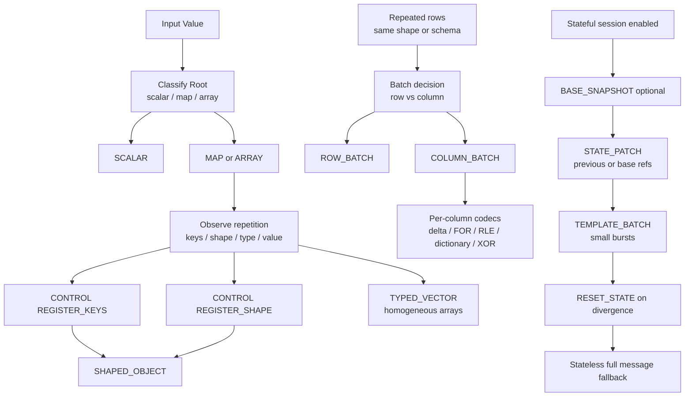

# Encoding Structure Diagram

This diagram shows how an encoder typically moves from baseline dynamic forms to more compact forms as repetition appears.

Notes:

- `CONTROL` updates drive promotion to compact ids (`key_id`, `shape_id`, `string_id`).
- `COLUMN_BATCH` becomes more effective as row count and column regularity increase.
- `STATE_PATCH` is beneficial only when sender and receiver state are synchronized.
