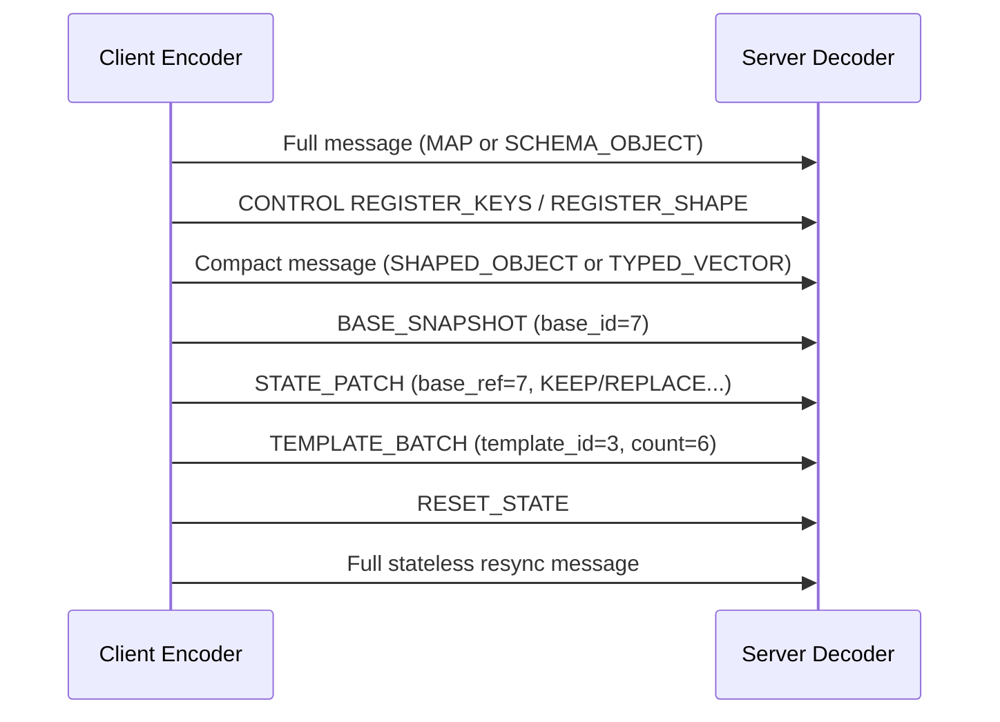

# Protocol Flow Diagram

This diagram describes a typical session timeline from bootstrap to stateful optimization and recovery.

Operational intent:

- Start with stateless messages for safe bootstrap.
- Register keys/shapes/strings once repetition appears.
- Use snapshot + patch + template only while state alignment is healthy.
- Reset and resync immediately when unknown references or divergence is detected.
